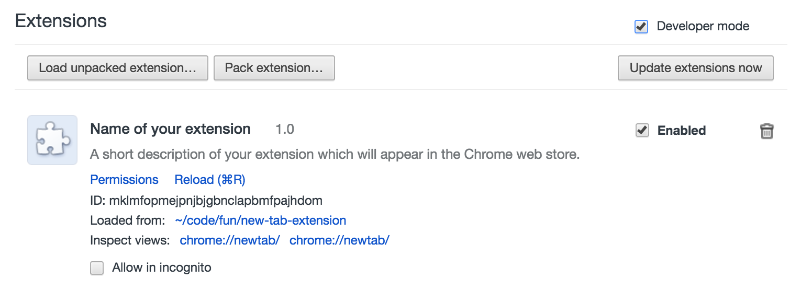

# New-Tab Extension Example
A basic new tab extension for Chrome to get you jump-started and building your own extension!

### How to run an extension in developer mode
In order to develop an extension you need to run it in "Developer mode". Here are the steps to do that...

1. Download this extension one of these 2 ways:
    * _The simple way:_ Click the green **Clone or Download** button on this page, then click **Download ZIP**, and then unzip the file on your computer. Voila! Now you have a copy that you can run in your browser.
    * _The Git way:_ If you're comfortable with Git, you can download this repository by [forking and cloning it to your computer](https://help.github.com/articles/fork-a-repo/).
2. Open Google Chrome.
3. Go to the **Extensions** page. Here are some ways to get there:
    * Type `chrome://extensions` into the URL bar and hit enter (where you'd usually type things like "www.google.com").
    * Go to **Window** and then select **Extensions**.
    * Click the icon with three dots in the upper right corner of Chrome. Then hover on **More Tools** and then select **Extensions**.
4. When you're in Extensions, click the checkbox labeled **Developer mode**. (It's at the top right corner of the list of extensions).
5. When developer mode is enabled, you should see some new buttons appear. Click the **Load unpacked extension...** button. ("Unpacked" simply means that it hasn't been zipped up because you're still working on it. When you publish your extension to the Chrome store, you need to zip it up, but don't worry about that yet.)
6. Find and select your project folder on your computer.
    * If it's running correctly, you should see something like this.
    
    * If there's an error, you'll see a yellow box appear that will tell you what's wrong.

7. Open a new tab, and see the extension running! Now when you make changes, you can refresh the page and see your changes.
